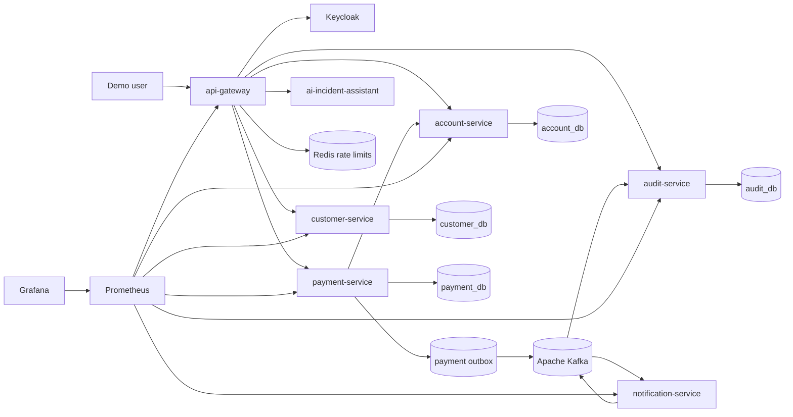
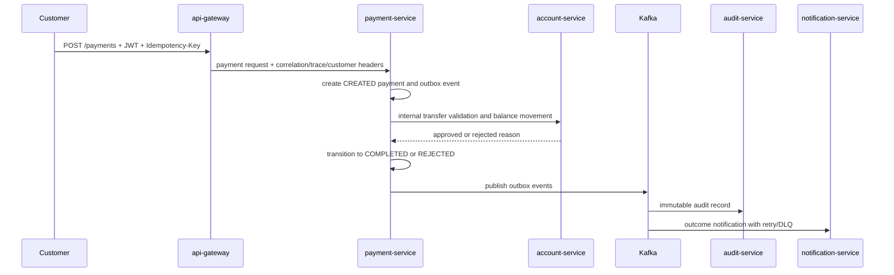
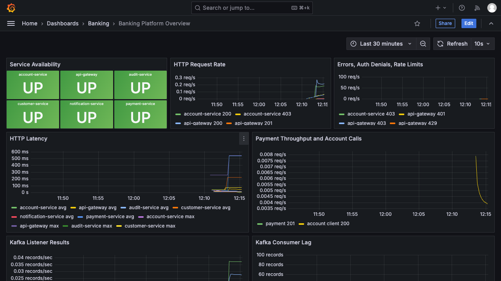

# Event-Driven Banking Platform

Production-style portfolio monorepo for a secure, observable, event-driven banking platform. It combines Spring Boot services, Keycloak OAuth2/OIDC, Kafka-compatible workflows, PostgreSQL service-owned databases, transactional outbox, retry/DLQ behavior, Prometheus/Grafana/OpenTelemetry, CI/CD, deterministic demos, and an evidence-based AI incident assistant that runs without paid API keys.

## Architecture



## Banking Flow



## Stack

- Java 21, Spring Boot 3, Maven monorepo.
- Spring Cloud Gateway, Spring Security, OAuth2 resource server.
- Keycloak demo realm with roles: `CUSTOMER`, `SUPPORT_AGENT`, `BACKOFFICE_OPERATOR`, `AUDITOR`, `SRE`, `ADMIN`.
- PostgreSQL databases per service.
- Apache Kafka as the local event broker.
- Redis gateway rate limits.
- OpenTelemetry collector, Prometheus, Grafana.
- Python FastAPI AI incident assistant.
- JUnit 5 tests, CI workflow, Jenkinsfile, Docker Compose/Podman Compose.

## Quickstart

Requirements:

- Java 21+ available locally. The included `./mvnw` downloads Maven automatically.
- Python 3.12+ for AI assistant tests.
- Podman with Compose support, or set `COMPOSE="docker compose"`.

```sh
cp .env.example .env
chmod +x mvnw scripts/*.sh scripts/simulations/*.sh
make test
make up
make seed
make demo
make smoke
make e2e-test
```

Local URLs:

- Gateway: `http://localhost:18080`
- Keycloak: `http://localhost:18089`
- AI assistant direct health: `http://localhost:18090/health`
- Prometheus: `http://localhost:19091`
- Grafana: `http://localhost:13000` (`admin/admin`)

## Demo Users

| User | Password | Roles | Customer ID |
| --- | --- | --- | --- |
| `alice` | `password` | `CUSTOMER` | `11111111-1111-1111-1111-111111111111` |
| `bob` | `password` | `CUSTOMER` | `22222222-2222-2222-2222-222222222222` |
| `support` | `password` | `SUPPORT_AGENT` | n/a |
| `auditor` | `password` | `AUDITOR` | n/a |
| `sre` | `password` | `SRE` | n/a |
| `admin` | `password` | `ADMIN`, `SRE`, `AUDITOR` | n/a |

## Features

- Gateway as the sole public entry point.
- JWT role enforcement and claim propagation.
- Correlation and trace IDs propagated through HTTP, events, and audit.
- Service-owned databases for customers, accounts, payments, and audit.
- CHF/EUR/USD accounts with minor-unit balances and `ACTIVE/FROZEN/CLOSED` states.
- Idempotent payment creation with duplicate key protection.
- Payment transitions: `CREATED`, `VALIDATED`, `PROCESSING`, `COMPLETED`, `REJECTED`, `FAILED`, `CANCELLED`.
- Transactional outbox for payment events.
- Audit consumer for business/security events.
- Notification consumer with retry, DLQ, and SRE-triggered replay by correlation ID.
- Rule-based AI assistant that only reports causes backed by supplied evidence.

## Make Targets

| Target | Purpose |
| --- | --- |
| `make up` | Build and start the local stack |
| `make down` | Stop and delete local volumes |
| `make seed` | Print deterministic users and account IDs |
| `make test` | Run Java unit tests and AI rule-engine tests |
| `make integration-test` | Run Maven integration phase, smoke test, and E2E runtime contract |
| `make e2e-test` | Prove auth, ownership, payment idempotency, Kafka, audit, notification DLQ/replay, metrics, trace export, and AI evidence through Compose |
| `make demo` | Create an idempotent payment and AI incident report |
| `make logs` | Follow Compose logs |
| `make helm-template` | Render the Kubernetes Helm chart when `helm` is available |
| `make simulate-payment-stuck` | Send stuck-payment evidence to AI assistant |
| `make simulate-notification-failure` | Force a notification DLQ, replay it, and analyze DLQ evidence |
| `make simulate-auth-failure` | Trigger an unauthenticated call and analyze auth failure evidence |
| `make simulate-high-latency` | Analyze latency/database evidence |
| `make simulate-kafka-lag` | Analyze Kafka lag evidence |

## Events

All events use a versioned envelope with:

`eventId`, `eventType`, `eventVersion`, `occurredAt`, `producer`, `correlationId`, `causationId`, `traceId`, `subject`, `payload`.

See [docs/events.md](docs/events.md).

## Security

The gateway validates Keycloak JWTs, enforces route roles, applies Redis rate limits, propagates only trusted identity headers, adds security headers, and separates customer ownership checks into downstream services. Sensitive values are excluded from committed config and audit payloads.

See [docs/owasp-api-security-map.md](docs/owasp-api-security-map.md).

## Observability

Each Java service exposes `/actuator/health` and `/actuator/prometheus`, emits Micrometer/OpenTelemetry spans to the local collector over OTLP, and propagates correlation/trace IDs through HTTP and event metadata. Payment spans are tagged with `banking.correlation_id` and `banking.trace_id`; the Compose E2E contract checks the collector output for the exported trace tag. Prometheus loads the local alert rules from [docs/alerts/prometheus-rules.yml](docs/alerts/prometheus-rules.yml), and Grafana provisions the banking overview dashboard automatically.



## AI Incident Assistant

The FastAPI assistant accepts logs, metrics, trace IDs, Kafka lag/DLQ counts, and runbook references. It returns severity, summary, affected services, likely causes, confidence, evidence, trace IDs, checks, and runbooks. It intentionally returns no likely causes when evidence is absent.

## Tests

Current test coverage includes:

- Event envelope validation and immutability.
- Minor-unit account behavior.
- Payment idempotency request hashing.
- Notification failure switch.
- AI assistant evidence/no-evidence behavior.
- Compose smoke test for gateway health, AI health, idempotency, and AI evidence.
- Compose E2E runtime contract for 401/403/429, ownership isolation, payment completion, outbox publication, Kafka offsets, audit records, notification publication, notification DLQ/replay, gateway metrics, OpenTelemetry collector trace export, and AI report evidence.

Planned expansion includes Testcontainers integration tests, richer negative payment workflow tests, and schema compatibility checks.

## Documentation

- [SPEC.md](SPEC.md)
- [PLAN.md](PLAN.md)
- [STATUS.md](STATUS.md)
- [ADRs](docs/adrs)
- [OpenAPI](docs/openapi/payment-service.yaml)
- [Postman collection](docs/postman/banking-demo.postman_collection.json)
- [Runbooks](docs/runbooks)
- [Kubernetes / Helm](docs/kubernetes-helm.md)
- [Production readiness notes](docs/production-readiness.md)
- [CV / LinkedIn summary](docs/cv-linkedin-summary.md)

## Limitations

- Compose remains the canonical local runtime; the Helm chart packages the application services for clusters with external backing infrastructure.
- Database migrations currently rely on Hibernate `ddl-auto` for early MVP speed; Flyway/Liquibase is planned.
- The AI assistant is deterministic and rule-based first; model-provider support is optional future work.

## Roadmap

- Add Testcontainers integration tests for PostgreSQL, Kafka, and gateway security.
- Expand E2E assertions for richer replay safety checks and negative payment workflow cases.
- Add a real Kubernetes cluster smoke test and production values examples for managed dependencies.
- Add schema compatibility checks for event envelope versions.
